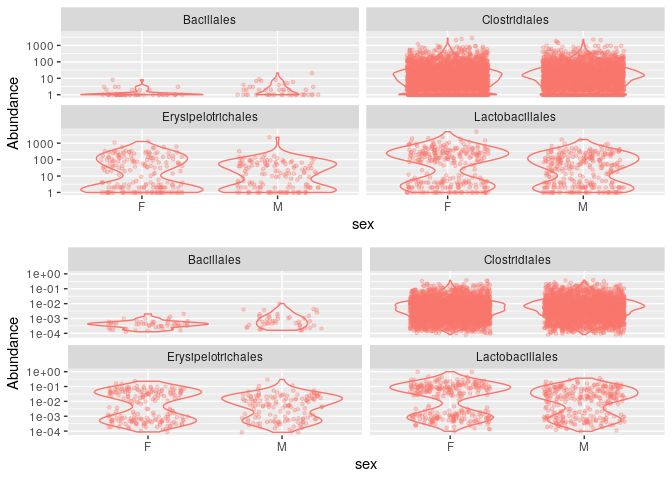
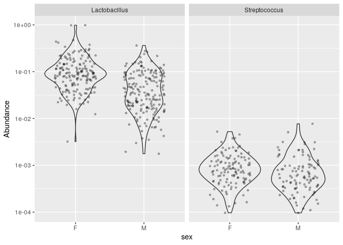
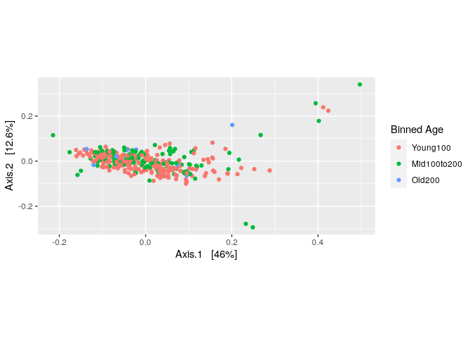
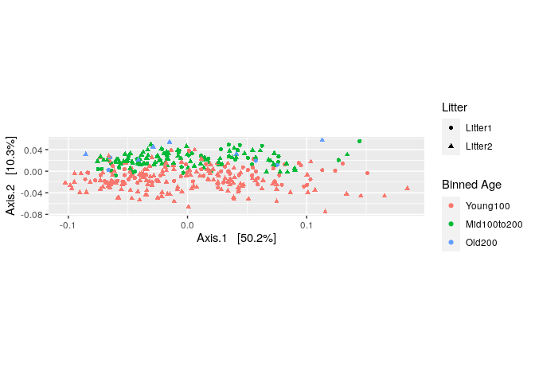
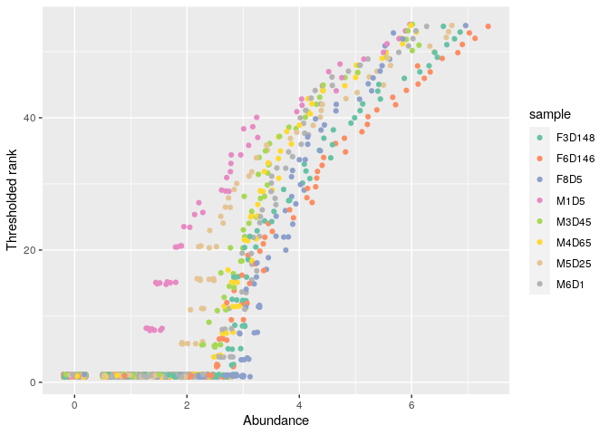
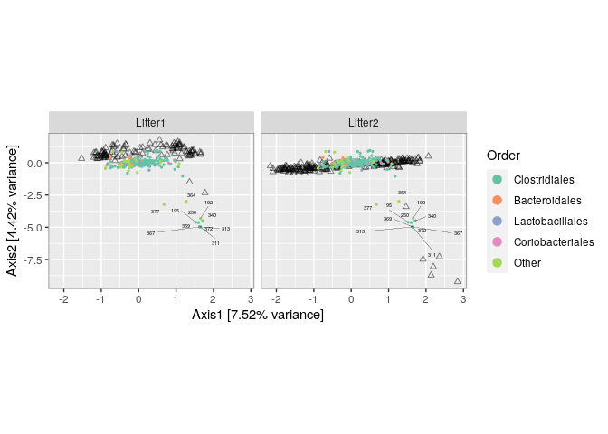
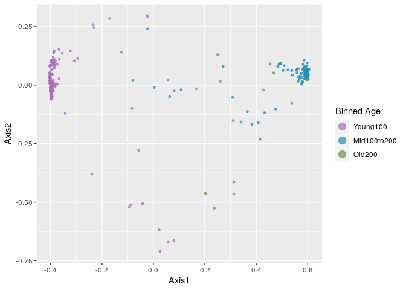
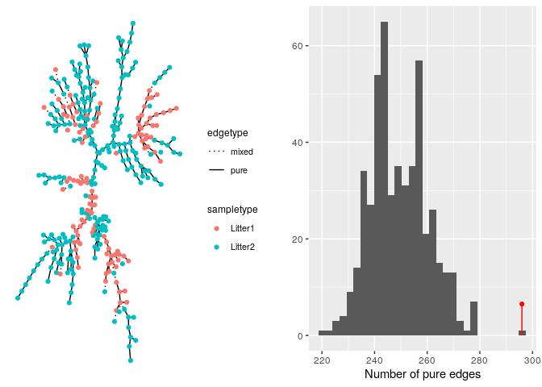
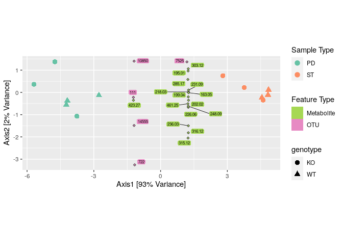

03\_analysis\_phylosec
================

  - [Starting Phyloseq tutorial](#starting-phyloseq-tutorial)
      - [Charger ce package pour éviter d’être
        bloqué](#charger-ce-package-pour-éviter-dêtre-bloqué)
      - [Import des nouvelles données + création objet
        ps](#import-des-nouvelles-données-création-objet-ps)
  - [Taxonomic filtering, on visualise les différent rangs de notre jeu
    de
    données](#taxonomic-filtering-on-visualise-les-différent-rangs-de-notre-jeu-de-données)
      - [Création d’une tabble contenant chaque phyla et leur
        nombre](#création-dune-tabble-contenant-chaque-phyla-et-leur-nombre)
      - [On enlève tout ce qui n’est pas
        caractérisé](#on-enlève-tout-ce-qui-nest-pas-caractérisé)
      - [On définit data.frame pour déterminer la prévalence et la
        caractérisation](#on-définit-data.frame-pour-déterminer-la-prévalence-et-la-caractérisation)
      - [Détermination des prévalences totales et moyenne de chaque
        phylum](#détermination-des-prévalences-totales-et-moyenne-de-chaque-phylum)
      - [On observe 2 phyla que l’on va
        filtrer](#on-observe-2-phyla-que-lon-va-filtrer)
  - [Filtrage](#filtrage)
      - [On définit les 2 phyla (Fusobacteria et Deinococcus) à
        filtrer](#on-définit-les-2-phyla-fusobacteria-et-deinococcus-à-filtrer)
  - [Création de plots](#création-de-plots)
      - [Plot de la prévalence des phyla par rapport à leur
        abondance](#plot-de-la-prévalence-des-phyla-par-rapport-à-leur-abondance)
      - [Seuil de prévalence fixé à 5% pour la totalité des
        échantillons](#seuil-de-prévalence-fixé-à-5-pour-la-totalité-des-échantillons)
      - [Execution du filtre de prévalence en utilisant la fonction
        prune\_taxa](#execution-du-filtre-de-prévalence-en-utilisant-la-fonction-prune_taxa)
      - [49 genres sont présents après
        filtrage.](#genres-sont-présents-après-filtrage.)
  - [Ps2 : OK // Suite = création de Ps3 et
    Ps4](#ps2-ok-suite-création-de-ps3-et-ps4)
  - [Utilisation de Ps(2,3 et4) pour un
    multiploting](#utilisation-de-ps23-et4-pour-un-multiploting)
      - [GridEtra permet de compiler toutes les données en plusieurs
        arbes suivant les
        caractéristiques](#gridetra-permet-de-compiler-toutes-les-données-en-plusieurs-arbes-suivant-les-caractéristiques)
      - [Plot de l’abondance en fonction des
        phyla](#plot-de-labondance-en-fonction-des-phyla)
      - [Ici on utilise une fonction pour avoir l’abondance
        relative](#ici-on-utilise-une-fonction-pour-avoir-labondance-relative)
      - [A l’aide de toutes les commandes précedantes on peut visualiser
        avec
        Gridextra](#a-laide-de-toutes-les-commandes-précedantes-on-peut-visualiser-avec-gridextra)
      - [On a vu que les Lactobacilles ont une taxonomie bimodale
        (profils) nous pourront vérifier cela avec la prochaine
        commande:](#on-a-vu-que-les-lactobacilles-ont-une-taxonomie-bimodale-profils-nous-pourront-vérifier-cela-avec-la-prochaine-commande)
  - [Pre-processing](#pre-processing)
      - [Chargement de tous les packages requis (Cran, github,
        BioC)](#chargement-de-tous-les-packages-requis-cran-github-bioc)
      - [Normalisation et ordination de nos données avec la commande
        suivante:](#normalisation-et-ordination-de-nos-données-avec-la-commande-suivante)
      - [Dissimilarité avec Bray-Curtis en fonction de l’age des hôtes.
        Constat : pas de réelle différence, impossible à
        discriminer.](#dissimilarité-avec-bray-curtis-en-fonction-de-lage-des-hôtes.-constat-pas-de-réelle-différence-impossible-à-discriminer.)
      - [Avec la commande suivante, on constate qu’il n’y a qu’une seule
        ASV dominante. (données abrérrantes vues
        précedement)](#avec-la-commande-suivante-on-constate-quil-ny-a-quune-seule-asv-dominante.-données-abrérrantes-vues-précedement)
      - [Grâce a nos commandes d’avant, on a pu identifier la
        morphologie et les caractéristiques de notre microbiome, et donc
        isoler les données abérrantes (comme vu au dessus) afin de les
        étudier de plus
        près](#grâce-a-nos-commandes-davant-on-a-pu-identifier-la-morphologie-et-les-caractéristiques-de-notre-microbiome-et-donc-isoler-les-données-abérrantes-comme-vu-au-dessus-afin-de-les-étudier-de-plus-près)
      - [Retrait de tous les échantillons avec moins de 1000
        reads](#retrait-de-tous-les-échantillons-avec-moins-de-1000-reads)
  - [PCOA avec la dissimilarité de
    Bray-Curtis](#pcoa-avec-la-dissimilarité-de-bray-curtis)
      - [La prochaine commande va faire une PCOA mais prendre en compte
        les données
        Phylogenétiques](#la-prochaine-commande-va-faire-une-pcoa-mais-prendre-en-compte-les-données-phylogenétiques)
      - [Dominé par l’axe1, on visualise 75% de
        variabilité](#dominé-par-laxe1-on-visualise-75-de-variabilité)
      - [Même chose que juste avant mais en faisant une ordination en
        fonction du
        phylum](#même-chose-que-juste-avant-mais-en-faisant-une-ordination-en-fonction-du-phylum)
      - [Position des echantillons par PCoA en uilisant Unifrac (permet
        de visualiser de maniere quantitative et
        qualitative)](#position-des-echantillons-par-pcoa-en-uilisant-unifrac-permet-de-visualiser-de-maniere-quantitative-et-qualitative)
  - [Création de Abund association avec la table
    d’OTU](#création-de-abund-association-avec-la-table-dotu)
      - [on va ignorer la data Brute et lui attribuer des
        rangs](#on-va-ignorer-la-data-brute-et-lui-attribuer-des-rangs)
      - [Chargement des packages et création du
        plot](#chargement-des-packages-et-création-du-plot)
      - [On observe l’abondance en fonction du seuil des rangs,
        d’échantillons prit au
        hasard](#on-observe-labondance-en-fonction-du-seuil-des-rangs-déchantillons-prit-au-hasard)
  - [Construction des Plots](#construction-des-plots)
      - [Avec les ordres, on visualise en fonction de la variance et de
        l’age des
        souris](#avec-les-ordres-on-visualise-en-fonction-de-la-variance-et-de-lage-des-souris)
  - [Incorporation de nouvelles composantes pour nos
    données](#incorporation-de-nouvelles-composantes-pour-nos-données)
      - [Chargement des packages pour incorporer des informations
        supplémentaires a nos échantillons
        :](#chargement-des-packages-pour-incorporer-des-informations-supplémentaires-a-nos-échantillons)
  - [Changement des données, par souris plutot que par
    echantillons](#changement-des-données-par-souris-plutot-que-par-echantillons)
      - [On obtient les classes (pls)
        ci-dessous](#on-obtient-les-classes-pls-ci-dessous)
      - [Un autre exemple ici avec
        randomForest](#un-autre-exemple-ici-avec-randomforest)
      - [Visualisation des plots avec nos changements
        (randomForest)](#visualisation-des-plots-avec-nos-changements-randomforest)
      - [Construction d’un proximity plot, qui prend en compte le nombre
        d’occurence d’un même echantillon pour un environnement
        donné](#construction-dun-proximity-plot-qui-prend-en-compte-le-nombre-doccurence-dun-même-echantillon-pour-un-environnement-donné)
  - [Abondance des bactéries pour un environnement
    donné](#abondance-des-bactéries-pour-un-environnement-donné)
      - [La prochaine commande nous permet de discriminer l’abondance en
        fonction du nombre
        d’échantillons](#la-prochaine-commande-nous-permet-de-discriminer-labondance-en-fonction-du-nombre-déchantillons)
      - [Cette jolie représentation nous informe par la couleur : la
        souris dont provient l’échantillon, et la forme : (cercle ou
        triangle) nous informe du biotope de la souris.On peut voir les
        interconnections entre les echantillons provenant de différentes
        souris de différents
        biotopes.](#cette-jolie-représentation-nous-informe-par-la-couleur-la-souris-dont-provient-léchantillon-et-la-forme-cercle-ou-triangle-nous-informe-du-biotope-de-la-souris.on-peut-voir-les-interconnections-entre-les-echantillons-provenant-de-différentes-souris-de-différents-biotopes.)
      - [La commande suivante permet de déterminer l’indice de
        jaccard](#la-commande-suivante-permet-de-déterminer-lindice-de-jaccard)
      - [Le prochain graph permet de visualiser avec une très petite
        p-value et l’exclusion que deux echantillons viennent du même
        endroit.](#le-prochain-graph-permet-de-visualiser-avec-une-très-petite-p-value-et-lexclusion-que-deux-echantillons-viennent-du-même-endroit.)
      - [En fait, la fonction family\_relationship permet de déterminer
        les echantillons ayant un “lien de
        parenté”](#en-fait-la-fonction-family_relationship-permet-de-déterminer-les-echantillons-ayant-un-lien-de-parenté)
      - [Network du voisin le plus proche et histogramme de
        permutations](#network-du-voisin-le-plus-proche-et-histogramme-de-permutations)
      - [De ce que j’ai compris le network ci-dessous permet de
        visualiser les liens unissant les échantillons venant du même
        endroit.](#de-ce-que-jai-compris-le-network-ci-dessous-permet-de-visualiser-les-liens-unissant-les-échantillons-venant-du-même-endroit.)
  - [Linear modeling](#linear-modeling)
      - [Les prochaines commandes vont nous permettre de visualiser la
        diversité en fonction des environnements avec l’indice de
        Shannon.](#les-prochaines-commandes-vont-nous-permettre-de-visualiser-la-diversité-en-fonction-des-environnements-avec-lindice-de-shannon.)
      - [On observe plusieurs graph avec plusieurs composantes : age des
        souris, environnements (litter 1 ; litter 2) et l’indice que
        shannon à gauche. (basée sur l’entropie) plus celle-ci est
        haute, plus il y a de différences
        significatives.](#on-observe-plusieurs-graph-avec-plusieurs-composantes-age-des-souris-environnements-litter-1-litter-2-et-lindice-que-shannon-à-gauche.-basée-sur-lentropie-plus-celle-ci-est-haute-plus-il-y-a-de-différences-significatives.)
  - [Hierarchical multiple testing](#hierarchical-multiple-testing)
      - [La fonction treePValues va nous permettre de discriminer en
        fonction du niveau taxonomique plutot que seulement par espèces
        bactériennes.](#la-fonction-treepvalues-va-nous-permettre-de-discriminer-en-fonction-du-niveau-taxonomique-plutot-que-seulement-par-espèces-bactériennes.)
      - [Visualisation sur un navigateur. (partie
        not-run)](#visualisation-sur-un-navigateur.-partie-not-run)
      - [Visualusation de la famille, genre, séquence et signification
        statistique (plus c’est bas plus c’est
        significatif)](#visualusation-de-la-famille-genre-séquence-et-signification-statistique-plus-cest-bas-plus-cest-significatif)
      - [On voit que les Lachnospiraceae sont très redondantes, cela
        confirme nos résultats précedement du
        random\_forest](#on-voit-que-les-lachnospiraceae-sont-très-redondantes-cela-confirme-nos-résultats-précedement-du-random_forest)
  - [Multitable techniques](#multitable-techniques)
      - [Déterminer les taxa en fonction de leur rangs (echantillon,
        rang
        taxonomique)](#déterminer-les-taxa-en-fonction-de-leur-rangs-echantillon-rang-taxonomique)
      - [On voit la fonction microbe = elle fait partie de
        phylosec.](#on-voit-la-fonction-microbe-elle-fait-partie-de-phylosec.)
      - [La prochaine commande va permettre de visualiser nos
        echantillons en fonction de plusieurs
        caractéristiques](#la-prochaine-commande-va-permettre-de-visualiser-nos-echantillons-en-fonction-de-plusieurs-caractéristiques)
      - [Triplot de nos echantillons en fonction des mutants/WT ;
        OTU/metabolite et PD/ST (régimes alimentaire des
        souris)](#triplot-de-nos-echantillons-en-fonction-des-mutantswt-otumetabolite-et-pdst-régimes-alimentaire-des-souris)
      - [On voit donc une différence en fonction de ces régimes, KO/WT
        confondus.](#on-voit-donc-une-différence-en-fonction-de-ces-régimes-kowt-confondus.)
      - [Pas de réelle différence entre les
        OTU/Metabolites](#pas-de-réelle-différence-entre-les-otumetabolites)
  - [Conclusion](#conclusion)
      - [(résumer cette conclusion me permettra de mieux apréhender le
        CC2)](#résumer-cette-conclusion-me-permettra-de-mieux-apréhender-le-cc2)
      - [Cette étude a permit de décrire de multiples fonctions de
        phylosec à travers quelque chose de concret. Allant de
        l’importation des données dans R à des représentation en
        biplot et triplot, permettant d’ajouter des caractéristiques
        pour des études plus fines des communautés microbiennes,
        Phylosec est un superbe outil. Une utilisation simple de l’arbre
        phylogenétique comme indicateur de distances entre OTUs et ASVs
        peut être faite avec unifrac ou avec phylosec comme vu
        précedement. Utilisation de l’entropie de Shannon et l’indice
        de
        Jaccard.](#cette-étude-a-permit-de-décrire-de-multiples-fonctions-de-phylosec-à-travers-quelque-chose-de-concret.-allant-de-limportation-des-données-dans-r-à-des-représentation-en-biplot-et-triplot-permettant-dajouter-des-caractéristiques-pour-des-études-plus-fines-des-communautés-microbiennes-phylosec-est-un-superbe-outil.-une-utilisation-simple-de-larbre-phylogenétique-comme-indicateur-de-distances-entre-otus-et-asvs-peut-être-faite-avec-unifrac-ou-avec-phylosec-comme-vu-précedement.-utilisation-de-lentropie-de-shannon-et-lindice-de-jaccard.)
  - [Fin phylosec](#fin-phylosec)

# Starting Phyloseq tutorial

## Charger ce package pour éviter d’être bloqué

``` r
library(ggplot2)
```

## Import des nouvelles données + création objet ps

``` r
ps_connect <-url("https://raw.githubusercontent.com/spholmes/F1000_workflow/master/data/ps.rds")
ps = readRDS(ps_connect)
ps
```

    ## Loading required package: phyloseq

    ## phyloseq-class experiment-level object
    ## otu_table()   OTU Table:         [ 389 taxa and 360 samples ]
    ## sample_data() Sample Data:       [ 360 samples by 14 sample variables ]
    ## tax_table()   Taxonomy Table:    [ 389 taxa by 6 taxonomic ranks ]
    ## phy_tree()    Phylogenetic Tree: [ 389 tips and 387 internal nodes ]

# Taxonomic filtering, on visualise les différent rangs de notre jeu de données

``` r
rank_names(ps)
```

    ## [1] "Kingdom" "Phylum"  "Class"   "Order"   "Family"  "Genus"

## Création d’une tabble contenant chaque phyla et leur nombre

``` r
table(tax_table(ps)[, "Phylum"], exclude = NULL)
```

    ## 
    ##              Actinobacteria               Bacteroidetes 
    ##                          13                          23 
    ## Candidatus_Saccharibacteria   Cyanobacteria/Chloroplast 
    ##                           1                           4 
    ##         Deinococcus-Thermus                  Firmicutes 
    ##                           1                         327 
    ##                Fusobacteria              Proteobacteria 
    ##                           1                          11 
    ##                 Tenericutes             Verrucomicrobia 
    ##                           1                           1 
    ##                        <NA> 
    ##                           6

## On enlève tout ce qui n’est pas caractérisé

``` r
ps <- subset_taxa(ps, !is.na(Phylum) & !Phylum %in% c("", "uncharacterized"))
```

## On définit data.frame pour déterminer la prévalence et la caractérisation

``` r
prevdf = apply(X = otu_table(ps),
               MARGIN = ifelse(taxa_are_rows(ps), yes = 1, no = 2),
               FUN = function(x){sum(x > 0)})
prevdf = data.frame(Prevalence = prevdf,
                    TotalAbundance = taxa_sums(ps),
                    tax_table(ps))
```

## Détermination des prévalences totales et moyenne de chaque phylum

``` r
plyr::ddply(prevdf, "Phylum", function(df1){cbind(mean(df1$Prevalence),sum(df1$Prevalence))})
```

    ##                         Phylum         1     2
    ## 1               Actinobacteria 120.15385  1562
    ## 2                Bacteroidetes 265.52174  6107
    ## 3  Candidatus_Saccharibacteria 280.00000   280
    ## 4    Cyanobacteria/Chloroplast  64.25000   257
    ## 5          Deinococcus-Thermus  52.00000    52
    ## 6                   Firmicutes 179.24771 58614
    ## 7                 Fusobacteria   2.00000     2
    ## 8               Proteobacteria  59.09091   650
    ## 9                  Tenericutes 234.00000   234
    ## 10             Verrucomicrobia 104.00000   104

## On observe 2 phyla que l’on va filtrer

# Filtrage

## On définit les 2 phyla (Fusobacteria et Deinococcus) à filtrer

``` r
filterPhyla = c("Fusobacteria", "Deinococcus-Thermus")
ps1 = subset_taxa(ps, !Phylum %in% filterPhyla)
ps1
```

    ## phyloseq-class experiment-level object
    ## otu_table()   OTU Table:         [ 381 taxa and 360 samples ]
    ## sample_data() Sample Data:       [ 360 samples by 14 sample variables ]
    ## tax_table()   Taxonomy Table:    [ 381 taxa by 6 taxonomic ranks ]
    ## phy_tree()    Phylogenetic Tree: [ 381 tips and 379 internal nodes ]

# Création de plots

## Plot de la prévalence des phyla par rapport à leur abondance

``` r
prevdf1 = subset(prevdf, Phylum %in% get_taxa_unique(ps1, "Phylum"))
ggplot(prevdf1, aes(TotalAbundance, Prevalence / nsamples(ps),color=Phylum)) +

  geom_hline(yintercept = 0.05, alpha = 0.5, linetype = 2) +  geom_point(size = 2, alpha = 0.7) +
  scale_x_log10() +  xlab("Total Abundance") + ylab("Prevalence [Frac. Samples]") +
  facet_wrap(~Phylum) + theme(legend.position="none")
```

<!-- -->
\#\# On observe que les Firmicutes et Bacteroidetes ont une prévalence
et abondance élevée dans tous les echantillons

## Seuil de prévalence fixé à 5% pour la totalité des échantillons

``` r
# Define prevalence threshold as 5% of total samples
prevalenceThreshold = 0.05 * nsamples(ps)
prevalenceThreshold
```

    ## [1] 18

## Execution du filtre de prévalence en utilisant la fonction prune\_taxa

``` r
keepTaxa = rownames(prevdf1)[(prevdf1$Prevalence >= prevalenceThreshold)]
ps2 = prune_taxa(keepTaxa, ps)
```

## 49 genres sont présents après filtrage.

``` r
# How many genera would be present after filtering?
length(get_taxa_unique(ps2, taxonomic.rank = "Genus"))
```

    ## [1] 49

# Ps2 : OK // Suite = création de Ps3 et Ps4

``` r
ps3 = tax_glom(ps2, "Genus", NArm = TRUE)
```

``` r
h1 = 0.4
ps4 = tip_glom(ps2, h = h1)
```

# Utilisation de Ps(2,3 et4) pour un multiploting

``` r
multiPlotTitleTextSize = 15
p2tree = plot_tree(ps2, method = "treeonly",
                   ladderize = "left",
                   title = "Before Agglomeration") +
  theme(plot.title = element_text(size = multiPlotTitleTextSize))
p3tree = plot_tree(ps3, method = "treeonly",
                   ladderize = "left", title = "By Genus") +
  theme(plot.title = element_text(size = multiPlotTitleTextSize))
p4tree = plot_tree(ps4, method = "treeonly",
                   ladderize = "left", title = "By Height") +
  theme(plot.title = element_text(size = multiPlotTitleTextSize))
```

## GridEtra permet de compiler toutes les données en plusieurs arbes suivant les caractéristiques

``` r
gridExtra::grid.arrange (nrow = 1, p2tree, p3tree, p4tree)
```

<!-- -->

## Plot de l’abondance en fonction des phyla

``` r
plot_abundance = function(physeq,title = "",
                          Facet = "Order", Color = "Phylum"){
  # Arbitrary subset, based on Phylum, for plotting
  p1f = subset_taxa(physeq, Phylum %in% c("Firmicutes"))
  mphyseq = psmelt(p1f)
  mphyseq <- subset(mphyseq, Abundance > 0)
  ggplot(data = mphyseq, mapping = aes_string(x = "sex",y = "Abundance",
                              color = Color, fill = Color)) +
    geom_violin(fill = NA) +
    geom_point(size = 1, alpha = 0.3,
               position = position_jitter(width = 0.3)) +
    facet_wrap(facets = Facet) + scale_y_log10()+
    theme(legend.position="none")
}
```

## Ici on utilise une fonction pour avoir l’abondance relative

``` r
# Transform to relative abundance. Save as new object.
ps3ra = transform_sample_counts(ps3, function(x){x / sum(x)})
```

## A l’aide de toutes les commandes précedantes on peut visualiser avec Gridextra

``` r
plotBefore = plot_abundance(ps3,"")
plotAfter = plot_abundance(ps3ra,"")
# Combine each plot into one graphic.
gridExtra::grid.arrange(nrow = 2,  plotBefore, plotAfter)
```

<!-- -->
\#\# Observation : La plupart des genres voient leur distribution
homogène à l’exception des Bacillales (peu abondantes) Les
clostridiales voient leur abondance inchangée. On voit donc la
comparaison entre l’abondance de départ contre l’abondance relative.
(avant et après transformation)

## On a vu que les Lactobacilles ont une taxonomie bimodale (profils) nous pourront vérifier cela avec la prochaine commande:

``` r
psOrd = subset_taxa(ps3ra, Order == "Lactobacillales")
plot_abundance(psOrd, Facet = "Genus", Color = NULL)
```

<!-- -->
\#\# Obtention de deux genres différents au sein des Lactobacillus

# Pre-processing

## Chargement de tous les packages requis (Cran, github, BioC)

``` r
qplot(sample_data(ps)$age, geom = "histogram",binwidth=20) + xlab("age")
```

<!-- -->

``` r
qplot(log10(rowSums(otu_table(ps))),binwidth=0.2) +
  xlab("Logged counts-per-sample")
```

<!-- -->

## Normalisation et ordination de nos données avec la commande suivante:

``` r
sample_data(ps)$age_binned <- cut(sample_data(ps)$age,
                          breaks = c(0, 100, 200, 400))
levels(sample_data(ps)$age_binned) <- list(Young100="(0,100]", Mid100to200="(100,200]", Old200="(200,400]")
sample_data(ps)$family_relationship=gsub(" ","",sample_data(ps)$family_relationship)
pslog <- transform_sample_counts(ps, function(x) log(1 + x))
out.wuf.log <- ordinate(pslog, method = "MDS", distance = "wunifrac")
```

    ## Warning in UniFrac(physeq, weighted = TRUE, ...): Randomly assigning root as --
    ## TCAAGCGTTGTTCGGAATCACTGGGCGTAAAGCGTGCGTAGGCTGTTTCGTAAGTCGTGTGTGAAAGGCGCGGGCTCAACCCGCGGACGGCACATGATACTGCGAGACTAGAGTAATGGAGGGGGAACCGGAATTCTCGGTGTAGCAGTGAAATGCGTAGATATCGAGAGGAACACTCGTGGCGAAGGCGGGTTCCTGGACATTAACTGACGCTGAGGCACGAAGGCCAGGGGAG
    ## -- in the phylogenetic tree in the data you provided.

``` r
evals <- out.wuf.log$values$Eigenvalues
plot_ordination(pslog, out.wuf.log, color = "age_binned") +
  labs(col = "Binned Age") +
  coord_fixed(sqrt(evals[2] / evals[1]))
```

<!-- -->

## Dissimilarité avec Bray-Curtis en fonction de l’age des hôtes. Constat : pas de réelle différence, impossible à discriminer.

## Avec la commande suivante, on constate qu’il n’y a qu’une seule ASV dominante. (données abrérrantes vues précedement)

``` r
rel_abund <- t(apply(otu_table(ps), 1, function(x) x / sum(x)))
qplot(rel_abund[, 12], geom = "histogram",binwidth=0.05) +
  xlab("Relative abundance")
```

<!-- -->
\# Etude des données aberrantes

## Grâce a nos commandes d’avant, on a pu identifier la morphologie et les caractéristiques de notre microbiome, et donc isoler les données abérrantes (comme vu au dessus) afin de les étudier de plus près

``` r
outliers <- c("F5D165", "F6D165", "M3D175", "M4D175", "M5D175", "M6D175")
ps <- prune_samples(!(sample_names(ps) %in% outliers), ps)
```

## Retrait de tous les échantillons avec moins de 1000 reads

``` r
which(!rowSums(otu_table(ps)) > 1000)
```

    ## F5D145 M1D149   M1D9 M2D125  M2D19 M3D148 M3D149   M3D3   M3D5   M3D8 
    ##     69    185    200    204    218    243    244    252    256    260

``` r
ps <- prune_samples(rowSums(otu_table(ps)) > 1000, ps)
pslog <- transform_sample_counts(ps, function(x) log(1 + x))
```

# PCOA avec la dissimilarité de Bray-Curtis

``` r
out.pcoa.log <- ordinate(pslog,  method = "MDS", distance = "bray")
evals <- out.pcoa.log$values[,1]
plot_ordination(pslog, out.pcoa.log, color = "age_binned",
                  shape = "family_relationship") +
  labs(col = "Binned Age", shape = "Litter")+
  coord_fixed(sqrt(evals[2] / evals[1]))
```

<!-- -->
\#\# On peut discriminer en fonction de l’age mais pas en fonction de
l’environnement

## La prochaine commande va faire une PCOA mais prendre en compte les données Phylogenétiques

``` r
out.dpcoa.log <- ordinate(pslog, method = "DPCoA")
evals <- out.dpcoa.log$eig
plot_ordination(pslog, out.dpcoa.log, color = "age_binned", label= "SampleID",
                  shape = "family_relationship") +
  labs(col = "Binned Age", shape = "Litter")+
  coord_fixed(sqrt(evals[2] / evals[1]))
```

<!-- -->

## Dominé par l’axe1, on visualise 75% de variabilité

## Même chose que juste avant mais en faisant une ordination en fonction du phylum

``` r
plot_ordination(pslog, out.dpcoa.log, type = "species", color = "Phylum") +
  coord_fixed(sqrt(evals[2] / evals[1]))
```

<!-- -->

## Position des echantillons par PCoA en uilisant Unifrac (permet de visualiser de maniere quantitative et qualitative)

``` r
out.wuf.log <- ordinate(pslog, method = "PCoA", distance ="wunifrac")
```

    ## Warning in UniFrac(physeq, weighted = TRUE, ...): Randomly assigning root as --
    ## GCGAGCGTTGTCCGGAATTACTGGGTGTAAAGGGAGCGTAGGCGGGACGGCAAGTCAGATGTGAAAACTGAGGGCTCAACCTTCAGACTGCATTTGAAACTGCTGTTCTTGAGTGAAGTAGAGGTAAGCGGAATTCCTAGTGTAGCGGTGAAATGCGTAGATATTAGGAGGAACATCGGTGGCGAAGGCGGCTTACTGGGCTTTTACTGACGCTGAGGCTCGAAAGCGTGGGGAG
    ## -- in the phylogenetic tree in the data you provided.

``` r
evals <- out.wuf.log$values$Eigenvalues
plot_ordination(pslog, out.wuf.log, color = "age_binned",
                  shape = "family_relationship") +
  coord_fixed(sqrt(evals[2] / evals[1])) +
  labs(col = "Binned Age", shape = "Litter")
```

<!-- -->

# Création de Abund association avec la table d’OTU

## on va ignorer la data Brute et lui attribuer des rangs

``` r
abund <- otu_table(pslog)
abund_ranks <- t(apply(abund, 1, rank))
```

## Chargement des packages et création du plot

``` r
abund_ranks <- abund_ranks - 329
abund_ranks[abund_ranks < 1] <- 1
library(dplyr)
```

    ## 
    ## Attaching package: 'dplyr'

    ## The following objects are masked from 'package:stats':
    ## 
    ##     filter, lag

    ## The following objects are masked from 'package:base':
    ## 
    ##     intersect, setdiff, setequal, union

``` r
library(reshape2)
abund_df <- melt(abund, value.name = "abund") %>%
  left_join(melt(abund_ranks, value.name = "rank"))
```

    ## Joining, by = c("Var1", "Var2")

``` r
colnames(abund_df) <- c("sample", "seq", "abund", "rank")

abund_df <- melt(abund, value.name = "abund") %>%
  left_join(melt(abund_ranks, value.name = "rank"))
```

    ## Joining, by = c("Var1", "Var2")

``` r
colnames(abund_df) <- c("sample", "seq", "abund", "rank")

sample_ix <- sample(1:nrow(abund_df), 8)
ggplot(abund_df %>%
         filter(sample %in% abund_df$sample[sample_ix])) +
  geom_point(aes(x = abund, y = rank, col = sample),
             position = position_jitter(width = 0.2), size = 1.5) +
  labs(x = "Abundance", y = "Thresholded rank") +
  scale_color_brewer(palette = "Set2")
```

<!-- -->

## On observe l’abondance en fonction du seuil des rangs, d’échantillons prit au hasard

# Construction des Plots

## Avec les ordres, on visualise en fonction de la variance et de l’age des souris

``` r
library(ade4)
ranks_pca <- dudi.pca(abund_ranks, scannf = F, nf = 3)
row_scores <- data.frame(li = ranks_pca$li,
                         SampleID = rownames(abund_ranks))
col_scores <- data.frame(co = ranks_pca$co,
                         seq = colnames(abund_ranks))
tax <- tax_table(ps) %>%
  data.frame(stringsAsFactors = FALSE)
tax$seq <- rownames(tax)
main_orders <- c("Clostridiales", "Bacteroidales", "Lactobacillales",
                 "Coriobacteriales")
tax$Order[!(tax$Order %in% main_orders)] <- "Other"
tax$Order <- factor(tax$Order, levels = c(main_orders, "Other"))
tax$otu_id <- seq_len(ncol(otu_table(ps)))
row_scores <- row_scores %>%
  left_join(sample_data(pslog))
```

    ## Joining, by = "SampleID"

    ## Warning in class(x) <- c(setdiff(subclass, tibble_class), tibble_class): Setting
    ## class(x) to multiple strings ("tbl_df", "tbl", ...); result will no longer be an
    ## S4 object

``` r
col_scores <- col_scores %>%
  left_join(tax)
```

    ## Joining, by = "seq"

``` r
evals_prop <- 100 * (ranks_pca$eig / sum(ranks_pca$eig))
ggplot() +
  geom_point(data = row_scores, aes(x = li.Axis1, y = li.Axis2), shape = 2) +
  geom_point(data = col_scores, aes(x = 25 * co.Comp1, y = 25 * co.Comp2, col = Order),
             size = .3, alpha = 0.6) +
  scale_color_brewer(palette = "Set2") +
  facet_grid(~ age_binned) +
  guides(col = guide_legend(override.aes = list(size = 3))) +
  labs(x = sprintf("Axis1 [%s%% variance]", round(evals_prop[1], 2)),
       y = sprintf("Axis2 [%s%% variance]", round(evals_prop[2], 2))) +
  coord_fixed(sqrt(ranks_pca$eig[2] / ranks_pca$eig[1])) +
  theme(panel.border = element_rect(color = "#787878", fill = alpha("white", 0)))
```

<!-- -->

# Incorporation de nouvelles composantes pour nos données

``` r
ps_ccpna <- ordinate(pslog, "CCA", formula = pslog ~ age_binned + family_relationship)
```

## Chargement des packages pour incorporer des informations supplémentaires a nos échantillons :

``` r
library(ggrepel)
ps_scores <- vegan::scores(ps_ccpna)
sites <- data.frame(ps_scores$sites)
sites$SampleID <- rownames(sites)
sites <- sites %>%
  left_join(sample_data(ps))
```

    ## Joining, by = "SampleID"

    ## Warning in class(x) <- c(setdiff(subclass, tibble_class), tibble_class): Setting
    ## class(x) to multiple strings ("tbl_df", "tbl", ...); result will no longer be an
    ## S4 object

``` r
species <- data.frame(ps_scores$species)
species$otu_id <- seq_along(colnames(otu_table(ps)))
species <- species %>%
  left_join(tax)
```

    ## Joining, by = "otu_id"

``` r
evals_prop <- 100 * ps_ccpna$CCA$eig[1:2] / sum(ps_ccpna$CA$eig)
ggplot() +
  geom_point(data = sites, aes(x = CCA1, y = CCA2), shape = 2, alpha = 0.5) +
  geom_point(data = species, aes(x = CCA1, y = CCA2, col = Order), size = 0.5) +
  geom_text_repel(data = species %>% filter(CCA2 < -2),
                    aes(x = CCA1, y = CCA2, label = otu_id),
            size = 1.5, segment.size = 0.1) +
  facet_grid(. ~ family_relationship) +
  guides(col = guide_legend(override.aes = list(size = 3))) +
  labs(x = sprintf("Axis1 [%s%% variance]", round(evals_prop[1], 2)),
        y = sprintf("Axis2 [%s%% variance]", round(evals_prop[2], 2))) +
  scale_color_brewer(palette = "Set2") +
  coord_fixed(sqrt(ps_ccpna$CCA$eig[2] / ps_ccpna$CCA$eig[1])*0.45   ) +
  theme(panel.border = element_rect(color = "#787878", fill = alpha("white", 0)))
```

<!-- -->
\#\# On a ici une ordination séparée par environnements avec les
différents ordres

# Changement des données, par souris plutot que par echantillons

``` r
library(caret)
```

    ## Loading required package: lattice

``` r
sample_data(pslog)$age2 <- cut(sample_data(pslog)$age, c(0, 100, 400))
dataMatrix <- data.frame(age = sample_data(pslog)$age2, otu_table(pslog))
# take 8 mice at random to be the training set, and the remaining 4 the test set
trainingMice <- sample(unique(sample_data(pslog)$host_subject_id), size = 8)
inTrain <- which(sample_data(pslog)$host_subject_id %in% trainingMice)
training <- dataMatrix[inTrain,]
testing <- dataMatrix[-inTrain,]
plsFit <- train(age ~ ., data = training,
                method = "pls", preProc = "center")
```

## On obtient les classes (pls) ci-dessous

``` r
plsClasses <- predict(plsFit, newdata = testing)
table(plsClasses, testing$age)
```

    ##            
    ## plsClasses  (0,100] (100,400]
    ##   (0,100]        66         1
    ##   (100,400]       3        44

## Un autre exemple ici avec randomForest

``` r
library(randomForest)
```

    ## randomForest 4.6-14

    ## Type rfNews() to see new features/changes/bug fixes.

    ## 
    ## Attaching package: 'randomForest'

    ## The following object is masked from 'package:dplyr':
    ## 
    ##     combine

    ## The following object is masked from 'package:ggplot2':
    ## 
    ##     margin

``` r
rfFit <- train(age ~ ., data = training, method = "rf",
               preProc = "center", proximity = TRUE)
rfClasses <- predict(rfFit, newdata = testing)
table(rfClasses, testing$age)
```

    ##            
    ## rfClasses   (0,100] (100,400]
    ##   (0,100]        67         1
    ##   (100,400]       2        44

``` r
library(vegan)
```

    ## Loading required package: permute

    ## This is vegan 2.5-6

    ## 
    ## Attaching package: 'vegan'

    ## The following object is masked from 'package:caret':
    ## 
    ##     tolerance

## Visualisation des plots avec nos changements (randomForest)

``` r
pls_biplot <- list("loadings" = loadings(plsFit$finalModel),
                   "scores" = scores(plsFit$finalModel))
class(pls_biplot$scores) <- "matrix"

pls_biplot$scores <- data.frame(sample_data(pslog)[inTrain, ],
                                pls_biplot$scores)

tax <- tax_table(ps)@.Data %>%
  data.frame(stringsAsFactors = FALSE)
main_orders <- c("Clostridiales", "Bacteroidales", "Lactobacillales",
                 "Coriobacteriales")
tax$Order[!(tax$Order %in% main_orders)] <- "Other"
tax$Order <- factor(tax$Order, levels = c(main_orders, "Other"))
class(pls_biplot$loadings) <- "matrix"
pls_biplot$loadings <- data.frame(tax, pls_biplot$loadings)
```

``` r
ggplot() +
  geom_point(data = pls_biplot$scores,
             aes(x = Comp.1, y = Comp.2), shape = 2) +
  geom_point(data = pls_biplot$loadings,
             aes(x = 25 * Comp.1, y = 25 * Comp.2, col = Order),
             size = 0.3, alpha = 0.6) +
  scale_color_brewer(palette = "Set2") +
  labs(x = "Axis1", y = "Axis2", col = "Binned Age") +
  guides(col = guide_legend(override.aes = list(size = 3))) +
  facet_grid( ~ age2) +
  theme(panel.border = element_rect(color = "#787878", fill = alpha("white", 0)))
```

<!-- -->
\#\# Grâce à la fonction PLS on peut mieux visualiser les données
discriminantes

## Construction d’un proximity plot, qui prend en compte le nombre d’occurence d’un même echantillon pour un environnement donné

``` r
rf_prox <- cmdscale(1 - rfFit$finalModel$proximity) %>%
  data.frame(sample_data(pslog)[inTrain, ])

ggplot(rf_prox) +
  geom_point(aes(x = X1, y = X2, col = age_binned),
             size = 1, alpha = 0.7) +
  scale_color_manual(values = c("#A66EB8", "#238DB5", "#748B4F")) +
  guides(col = guide_legend(override.aes = list(size = 4))) +
  labs(col = "Binned Age", x = "Axis1", y = "Axis2")
```

<!-- -->
\#\# On peut voir une occurence différente en fonction de l’âge

# Abondance des bactéries pour un environnement donné

## La prochaine commande nous permet de discriminer l’abondance en fonction du nombre d’échantillons

``` r
as.vector(tax_table(ps)[which.max(importance(rfFit$finalModel)), c("Family", "Genus")])
```

    ## [1] "Lachnospiraceae" "Roseburia"

``` r
## [1] "Lachnospiraceae" "Roseburia"
impOtu <- as.vector(otu_table(pslog)[,which.max(importance(rfFit$finalModel))])
maxImpDF <- data.frame(sample_data(pslog), abund = impOtu)
ggplot(maxImpDF) +   geom_histogram(aes(x = abund)) +
  facet_grid(age2 ~ .) +
  labs(x = "Abundance of discriminative bacteria", y = "Number of samples")
```

    ## `stat_bin()` using `bins = 30`. Pick better value with `binwidth`.

<!-- -->

``` r
library("phyloseqGraphTest")
library("igraph")
```

    ## 
    ## Attaching package: 'igraph'

    ## The following object is masked from 'package:vegan':
    ## 
    ##     diversity

    ## The following object is masked from 'package:permute':
    ## 
    ##     permute

    ## The following objects are masked from 'package:dplyr':
    ## 
    ##     as_data_frame, groups, union

    ## The following objects are masked from 'package:stats':
    ## 
    ##     decompose, spectrum

    ## The following object is masked from 'package:base':
    ## 
    ##     union

``` r
library("ggnetwork")
net <- make_network(ps, max.dist=0.35)
sampledata <- data.frame(sample_data(ps))
V(net)$id <- sampledata[names(V(net)), "host_subject_id"]
V(net)$litter <- sampledata[names(V(net)), "family_relationship"]
net_graph <- ggnetwork(net)
ggplot(net_graph, aes(x = x, y = y, xend = xend, yend = yend), layout = "fruchtermanreingold") +
  geom_edges(color = "darkgray") +
  geom_nodes(aes(color = id, shape = litter),  size = 3 ) +
  theme(axis.text = element_blank(), axis.title = element_blank(),
        legend.key.height = unit(0.5,"line")) +
  guides(col = guide_legend(override.aes = list(size = .5)))
```

<!-- -->

## Cette jolie représentation nous informe par la couleur : la souris dont provient l’échantillon, et la forme : (cercle ou triangle) nous informe du biotope de la souris.On peut voir les interconnections entre les echantillons provenant de différentes souris de différents biotopes.

\#Minimum Spanning Tree (MST)

## La commande suivante permet de déterminer l’indice de jaccard

``` r
gt <- graph_perm_test(ps, "family_relationship", grouping = "host_subject_id",
                      distance = "jaccard", type = "mst")
gt$pval
```

    ## [1] 0.004

## Le prochain graph permet de visualiser avec une très petite p-value et l’exclusion que deux echantillons viennent du même endroit.

``` r
plotNet1=plot_test_network(gt) + theme(legend.text = element_text(size = 8),
        legend.title = element_text(size = 9))
plotPerm1=plot_permutations(gt)
gridExtra::grid.arrange(ncol = 2,  plotNet1, plotPerm1)
```

<!-- -->

## En fait, la fonction family\_relationship permet de déterminer les echantillons ayant un “lien de parenté”

``` r
gt <- graph_perm_test(ps, "family_relationship", grouping = "host_subject_id",
                      distance = "jaccard", type = "knn", knn = 1)
```

## Network du voisin le plus proche et histogramme de permutations

## De ce que j’ai compris le network ci-dessous permet de visualiser les liens unissant les échantillons venant du même endroit.

``` r
plotNet2=plot_test_network(gt) + theme(legend.text = element_text(size = 8),
        legend.title = element_text(size = 9))
plotPerm2=plot_permutations(gt)
gridExtra::grid.arrange(ncol = 2,  plotNet2, plotPerm2)
```

<!-- -->

# Linear modeling

## Les prochaines commandes vont nous permettre de visualiser la diversité en fonction des environnements avec l’indice de Shannon.

``` r
library("nlme")
```

    ## 
    ## Attaching package: 'nlme'

    ## The following object is masked from 'package:dplyr':
    ## 
    ##     collapse

``` r
library("reshape2")
ps_alpha_div <- estimate_richness(ps, split = TRUE, measure = "Shannon")
ps_alpha_div$SampleID <- rownames(ps_alpha_div) %>%
  as.factor()
ps_samp <- sample_data(ps) %>%
  unclass() %>%
  data.frame() %>%
  left_join(ps_alpha_div, by = "SampleID") %>%
  melt(measure.vars = "Shannon",
       variable.name = "diversity_measure",
       value.name = "alpha_diversity")

# reorder's facet from lowest to highest diversity
diversity_means <- ps_samp %>%
  group_by(host_subject_id) %>%
  summarise(mean_div = mean(alpha_diversity)) %>%
  arrange(mean_div)
```

    ## `summarise()` ungrouping output (override with `.groups` argument)

``` r
ps_samp$host_subject_id <- factor(ps_samp$host_subject_id)
#                                  diversity_means$host_subject_id)
```

``` r
alpha_div_model <- lme(fixed = alpha_diversity ~ age_binned, data = ps_samp,
                       random = ~ 1 | host_subject_id)
new_data <- expand.grid(host_subject_id = levels(ps_samp$host_subject_id),
                        age_binned = levels(ps_samp$age_binned))
new_data$pred <- predict(alpha_div_model, newdata = new_data)
X <- model.matrix(eval(eval(alpha_div_model$call$fixed)[-2]),
                  new_data[-ncol(new_data)])
pred_var_fixed <- diag(X %*% alpha_div_model$varFix %*% t(X))
new_data$pred_var <- pred_var_fixed + alpha_div_model$sigma ^ 2
# fitted values, with error bars
ggplot(ps_samp %>% left_join(new_data)) +
  geom_errorbar(aes(x = age_binned, ymin = pred - 2 * sqrt(pred_var),
                    ymax = pred + 2 * sqrt(pred_var)),
                col = "#858585", size = .1) +
  geom_point(aes(x = age_binned, y = alpha_diversity,
                 col = family_relationship), size = 0.8) +
  facet_wrap(~host_subject_id) +
  scale_y_continuous(limits = c(2.4, 4.6), breaks = seq(0, 5, .5)) +
  scale_color_brewer(palette = "Set2") +
  labs(x = "Binned Age", y = "Shannon Diversity", color = "Litter") +
  guides(col = guide_legend(override.aes = list(size = 4))) +
  theme(panel.border = element_rect(color = "#787878", fill = alpha("white", 0)),
        axis.text.x = element_text(angle = -90, size = 6),
        axis.text.y = element_text(size = 6))
```

    ## Joining, by = c("host_subject_id", "age_binned")

<!-- -->

## On observe plusieurs graph avec plusieurs composantes : age des souris, environnements (litter 1 ; litter 2) et l’indice que shannon à gauche. (basée sur l’entropie) plus celle-ci est haute, plus il y a de différences significatives.

``` r
library("reshape2")
library("DESeq2")
```

    ## Loading required package: S4Vectors

    ## Loading required package: stats4

    ## Loading required package: BiocGenerics

    ## Loading required package: parallel

    ## 
    ## Attaching package: 'BiocGenerics'

    ## The following objects are masked from 'package:parallel':
    ## 
    ##     clusterApply, clusterApplyLB, clusterCall, clusterEvalQ,
    ##     clusterExport, clusterMap, parApply, parCapply, parLapply,
    ##     parLapplyLB, parRapply, parSapply, parSapplyLB

    ## The following objects are masked from 'package:igraph':
    ## 
    ##     normalize, path, union

    ## The following object is masked from 'package:randomForest':
    ## 
    ##     combine

    ## The following object is masked from 'package:ade4':
    ## 
    ##     score

    ## The following objects are masked from 'package:dplyr':
    ## 
    ##     combine, intersect, setdiff, union

    ## The following objects are masked from 'package:stats':
    ## 
    ##     IQR, mad, sd, var, xtabs

    ## The following objects are masked from 'package:base':
    ## 
    ##     anyDuplicated, append, as.data.frame, basename, cbind, colnames,
    ##     dirname, do.call, duplicated, eval, evalq, Filter, Find, get, grep,
    ##     grepl, intersect, is.unsorted, lapply, Map, mapply, match, mget,
    ##     order, paste, pmax, pmax.int, pmin, pmin.int, Position, rank,
    ##     rbind, Reduce, rownames, sapply, setdiff, sort, table, tapply,
    ##     union, unique, unsplit, which.max, which.min

    ## 
    ## Attaching package: 'S4Vectors'

    ## The following objects are masked from 'package:dplyr':
    ## 
    ##     first, rename

    ## The following object is masked from 'package:base':
    ## 
    ##     expand.grid

    ## Loading required package: IRanges

    ## 
    ## Attaching package: 'IRanges'

    ## The following object is masked from 'package:nlme':
    ## 
    ##     collapse

    ## The following objects are masked from 'package:dplyr':
    ## 
    ##     collapse, desc, slice

    ## The following object is masked from 'package:phyloseq':
    ## 
    ##     distance

    ## Loading required package: GenomicRanges

    ## Loading required package: GenomeInfoDb

    ## Loading required package: SummarizedExperiment

    ## Loading required package: MatrixGenerics

    ## Loading required package: matrixStats

    ## 
    ## Attaching package: 'matrixStats'

    ## The following object is masked from 'package:dplyr':
    ## 
    ##     count

    ## 
    ## Attaching package: 'MatrixGenerics'

    ## The following objects are masked from 'package:matrixStats':
    ## 
    ##     colAlls, colAnyNAs, colAnys, colAvgsPerRowSet, colCollapse,
    ##     colCounts, colCummaxs, colCummins, colCumprods, colCumsums,
    ##     colDiffs, colIQRDiffs, colIQRs, colLogSumExps, colMadDiffs,
    ##     colMads, colMaxs, colMeans2, colMedians, colMins, colOrderStats,
    ##     colProds, colQuantiles, colRanges, colRanks, colSdDiffs, colSds,
    ##     colSums2, colTabulates, colVarDiffs, colVars, colWeightedMads,
    ##     colWeightedMeans, colWeightedMedians, colWeightedSds,
    ##     colWeightedVars, rowAlls, rowAnyNAs, rowAnys, rowAvgsPerColSet,
    ##     rowCollapse, rowCounts, rowCummaxs, rowCummins, rowCumprods,
    ##     rowCumsums, rowDiffs, rowIQRDiffs, rowIQRs, rowLogSumExps,
    ##     rowMadDiffs, rowMads, rowMaxs, rowMeans2, rowMedians, rowMins,
    ##     rowOrderStats, rowProds, rowQuantiles, rowRanges, rowRanks,
    ##     rowSdDiffs, rowSds, rowSums2, rowTabulates, rowVarDiffs, rowVars,
    ##     rowWeightedMads, rowWeightedMeans, rowWeightedMedians,
    ##     rowWeightedSds, rowWeightedVars

    ## Loading required package: Biobase

    ## Welcome to Bioconductor
    ## 
    ##     Vignettes contain introductory material; view with
    ##     'browseVignettes()'. To cite Bioconductor, see
    ##     'citation("Biobase")', and for packages 'citation("pkgname")'.

    ## 
    ## Attaching package: 'Biobase'

    ## The following object is masked from 'package:MatrixGenerics':
    ## 
    ##     rowMedians

    ## The following objects are masked from 'package:matrixStats':
    ## 
    ##     anyMissing, rowMedians

    ## The following object is masked from 'package:phyloseq':
    ## 
    ##     sampleNames

``` r
#New version of DESeq2 needs special levels
sample_data(ps)$age_binned <- cut(sample_data(ps)$age,
                          breaks = c(0, 100, 200, 400))
levels(sample_data(ps)$age_binned) <- list(Young100="(0,100]", Mid100to200="(100,200]", Old200="(200,400]")
sample_data(ps)$family_relationship = gsub(" ", "", sample_data(ps)$family_relationship)
ps_dds <- phyloseq_to_deseq2(ps, design = ~ age_binned + family_relationship)
```

    ## converting counts to integer mode

    ## Warning in DESeqDataSet(se, design = design, ignoreRank): some variables in
    ## design formula are characters, converting to factors

``` r
# geometric mean, set to zero when all coordinates are zero
geo_mean_protected <- function(x) {
  if (all(x == 0)) {
    return (0)
  }
  exp(mean(log(x[x != 0])))
}

geoMeans <- apply(counts(ps_dds), 1, geo_mean_protected)
ps_dds <- estimateSizeFactors(ps_dds, geoMeans = geoMeans)
ps_dds <- estimateDispersions(ps_dds)
```

    ## gene-wise dispersion estimates

    ## mean-dispersion relationship

    ## final dispersion estimates

``` r
abund <- getVarianceStabilizedData(ps_dds)
```

# Hierarchical multiple testing

\#\#Les commandes suivantes nous permettent d’utiliser le package
DESeq2, nous voyons une distribution moins étalée mais plus abondante
que le graph du bas.

``` r
short_names <- substr(rownames(abund), 1, 5)%>%
  make.names(unique = TRUE)
rownames(abund) <- short_names
abund_sums <- rbind(data.frame(sum = colSums(abund),
                               sample = colnames(abund),
                               type = "DESeq2"),
                    data.frame(sum = rowSums(otu_table(pslog)),
                               sample = rownames(otu_table(pslog)),
                               type = "log(1 + x)"))

ggplot(abund_sums) +
  geom_histogram(aes(x = sum), binwidth = 20) +
  facet_grid(type ~ .) +
  xlab("Total abundance within sample")
```

<!-- -->

## La fonction treePValues va nous permettre de discriminer en fonction du niveau taxonomique plutot que seulement par espèces bactériennes.

``` r
library("structSSI")
el <- phy_tree(pslog)$edge
el0 <- el
el0 <- el0[nrow(el):1, ]
el_names <- c(short_names, seq_len(phy_tree(pslog)$Nnode))
el[, 1] <- el_names[el0[, 1]]
el[, 2] <- el_names[as.numeric(el0[, 2])]
unadj_p <- treePValues(el, abund, sample_data(pslog)$age_binned)
```

``` r
hfdr_res <- hFDR.adjust(unadj_p, el, .75)
summary(hfdr_res)
```

    ## Number of hypotheses: 764 
    ## Number of tree discoveries: 579 
    ## Estimated tree FDR: 1 
    ## Number of tip discoveries: 280 
    ## Estimated tips FDR: 1 
    ## 
    ##  hFDR adjusted p-values: 
    ##                 unadjp         adjp adj.significance
    ## GCAAG.95  1.861873e-82 3.723745e-82              ***
    ## GCAAG.70  1.131975e-75 2.263950e-75              ***
    ## GCAAG.187 5.148758e-59 1.029752e-58              ***
    ## GCAAG.251 3.519276e-50 7.038553e-50              ***
    ## GCAAG.148 1.274481e-49 2.548962e-49              ***
    ## GCAAG.30  9.925218e-49 1.985044e-48              ***
    ## GCGAG.76  1.722591e-46 3.445183e-46              ***
    ## GCAAG.167 6.249050e-43 1.249810e-42              ***
    ## 255       8.785479e-40 1.757096e-39              ***
    ## GCAAG.64  2.727610e-36 5.455219e-36              ***
    ## [only 10 most significant hypotheses shown] 
    ## --- 
    ## Signif. codes:  0 '***' 0.015 '**' 0.15 '*' 0.75 '.' 1.5 '-' 1

## Visualisation sur un navigateur. (partie not-run)

## Visualusation de la famille, genre, séquence et signification statistique (plus c’est bas plus c’est significatif)

``` r
tax <- tax_table(pslog)[, c("Family", "Genus")] %>%
  data.frame()
tax$seq <- short_names
options(digits=3)
hfdr_res@p.vals$seq <- rownames(hfdr_res@p.vals)
tax %>%
  left_join(hfdr_res@p.vals) %>%
  arrange(adjp) %>% head(10)
```

    ## Joining, by = "seq"

    ##             Family            Genus       seq   unadjp     adjp
    ## 1  Lachnospiraceae             <NA>  GCAAG.95 1.86e-82 3.72e-82
    ## 2  Lachnospiraceae        Roseburia  GCAAG.70 1.13e-75 2.26e-75
    ## 3  Lachnospiraceae Clostridium_XlVa GCAAG.187 5.15e-59 1.03e-58
    ## 4  Lachnospiraceae             <NA> GCAAG.251 3.52e-50 7.04e-50
    ## 5  Lachnospiraceae Clostridium_XlVa GCAAG.148 1.27e-49 2.55e-49
    ## 6  Lachnospiraceae             <NA>  GCAAG.30 9.93e-49 1.99e-48
    ## 7  Ruminococcaceae     Ruminococcus  GCGAG.76 1.72e-46 3.45e-46
    ## 8  Lachnospiraceae Clostridium_XlVa GCAAG.167 6.25e-43 1.25e-42
    ## 9  Lachnospiraceae        Roseburia  GCAAG.64 2.73e-36 5.46e-36
    ## 10            <NA>             <NA>   GCAAG.1 5.22e-35 1.04e-34
    ##    adj.significance
    ## 1               ***
    ## 2               ***
    ## 3               ***
    ## 4               ***
    ## 5               ***
    ## 6               ***
    ## 7               ***
    ## 8               ***
    ## 9               ***
    ## 10              ***

## On voit que les Lachnospiraceae sont très redondantes, cela confirme nos résultats précedement du random\_forest

# Multitable techniques

## Déterminer les taxa en fonction de leur rangs (echantillon, rang taxonomique)

``` r
metab <- read.csv("https://raw.githubusercontent.com/spholmes/F1000_workflow/master/data/metabolites.csv",row.names = 1)
microbe_connect <-url("https://raw.githubusercontent.com/spholmes/F1000_workflow/master/data/microbe.rda")
load(microbe_connect)
microbe
```

    ## phyloseq-class experiment-level object
    ## otu_table()   OTU Table:         [ 20609 taxa and 12 samples ]
    ## tax_table()   Taxonomy Table:    [ 20609 taxa by 6 taxonomic ranks ]
    ## phy_tree()    Phylogenetic Tree: [ 20609 tips and 20607 internal nodes ]

## On voit la fonction microbe = elle fait partie de phylosec.

``` r
library("genefilter")
```

    ## 
    ## Attaching package: 'genefilter'

    ## The following objects are masked from 'package:MatrixGenerics':
    ## 
    ##     rowSds, rowVars

    ## The following objects are masked from 'package:matrixStats':
    ## 
    ##     rowSds, rowVars

``` r
keep_ix <- rowSums(metab == 0) <= 3
metab <- metab[keep_ix, ]
microbe <- prune_taxa(taxa_sums(microbe) > 4, microbe)
microbe <- filter_taxa(microbe, filterfun(kOverA(3, 2)), TRUE)
metab <- log(1 + metab, base = 10)
X <- otu_table(microbe)
X[X > 50] <- 50
dim(X)
```

    ## [1] 174  12

``` r
dim(metab)
```

    ## [1] 405  12

``` r
library(PMA)
cca_res <- CCA(t(X),  t(metab), penaltyx = .15, penaltyz = .15)
```

    ## 123456789101112131415

``` r
cca_res
```

    ## Call: CCA(x = t(X), z = t(metab), penaltyx = 0.15, penaltyz = 0.15)
    ## 
    ## 
    ## Num non-zeros u's:  5 
    ## Num non-zeros v's:  15 
    ## Type of x:  standard 
    ## Type of z:  standard 
    ## Penalty for x: L1 bound is  0.15 
    ## Penalty for z: L1 bound is  0.15 
    ## Cor(Xu,Zv):  0.974

## La prochaine commande va permettre de visualiser nos echantillons en fonction de plusieurs caractéristiques

``` r
combined <- cbind(t(X[cca_res$u != 0, ]),
                  t(metab[cca_res$v != 0, ]))
pca_res <- dudi.pca(combined, scannf = F, nf = 3)
genotype <- substr(rownames(pca_res$li), 1, 2)
sample_type <- substr(rownames(pca_res$l1), 3, 4)
feature_type <- grepl("\\.", colnames(combined))
feature_type <- ifelse(feature_type, "Metabolite", "OTU")
sample_info <- data.frame(pca_res$li, genotype, sample_type)
feature_info <- data.frame(pca_res$c1,
                           feature = substr(colnames(combined), 1, 6))
ggplot() +  geom_point(data = sample_info,
            aes(x = Axis1, y = Axis2, col = sample_type, shape = genotype), size = 3) + 
  geom_label_repel(data = feature_info,
                   aes(x = 5.5 * CS1, y = 5.5 * CS2, label = feature, fill = feature_type),
                   size = 2, segment.size = 0.3,
                   label.padding = unit(0.1, "lines"), label.size = 0) +
  geom_point(data = feature_info,
             aes(x = 5.5 * CS1, y = 5.5 * CS2, fill = feature_type),
             size = 1, shape = 23, col = "#383838") +
  scale_color_brewer(palette = "Set2") +
  scale_fill_manual(values = c("#a6d854", "#e78ac3")) +
  guides(fill = guide_legend(override.aes = list(shape = 32, size = 0))) +
  coord_fixed(sqrt(pca_res$eig[2] / pca_res$eig[2])) +
  labs(x = sprintf("Axis1 [%s%% Variance]",
                   100 * round(pca_res$eig[1] / sum(pca_res$eig), 2)),
       y = sprintf("Axis2 [%s%% Variance]",
                   100 * round(pca_res$eig[2] / sum(pca_res$eig), 2)),
       fill = "Feature Type", col = "Sample Type")
```

<!-- -->

## Triplot de nos echantillons en fonction des mutants/WT ; OTU/metabolite et PD/ST (régimes alimentaire des souris)

## On voit donc une différence en fonction de ces régimes, KO/WT confondus.

## Pas de réelle différence entre les OTU/Metabolites

# Conclusion

## (résumer cette conclusion me permettra de mieux apréhender le CC2)

## Cette étude a permit de décrire de multiples fonctions de phylosec à travers quelque chose de concret. Allant de l’importation des données dans R à des représentation en biplot et triplot, permettant d’ajouter des caractéristiques pour des études plus fines des communautés microbiennes, Phylosec est un superbe outil. Une utilisation simple de l’arbre phylogenétique comme indicateur de distances entre OTUs et ASVs peut être faite avec unifrac ou avec phylosec comme vu précedement. Utilisation de l’entropie de Shannon et l’indice de Jaccard.

``` r
devtools::session_info()
```

    ## ─ Session info ───────────────────────────────────────────────────────────────
    ##  setting  value                       
    ##  version  R version 4.0.3 (2020-10-10)
    ##  os       Ubuntu 20.04 LTS            
    ##  system   x86_64, linux-gnu           
    ##  ui       X11                         
    ##  language (EN)                        
    ##  collate  en_US.UTF-8                 
    ##  ctype    en_US.UTF-8                 
    ##  tz       Etc/UTC                     
    ##  date     2020-12-02                  
    ## 
    ## ─ Packages ───────────────────────────────────────────────────────────────────
    ##  package              * version    date       lib
    ##  ade4                 * 1.7-16     2020-10-28 [1]
    ##  annotate               1.68.0     2020-10-27 [1]
    ##  AnnotationDbi          1.52.0     2020-10-27 [1]
    ##  ape                    5.4-1      2020-08-13 [1]
    ##  assertthat             0.2.1      2019-03-21 [1]
    ##  Biobase              * 2.50.0     2020-10-27 [1]
    ##  BiocGenerics         * 0.36.0     2020-10-27 [1]
    ##  BiocParallel           1.24.1     2020-11-06 [1]
    ##  biomformat             1.18.0     2020-10-27 [1]
    ##  Biostrings             2.58.0     2020-10-27 [1]
    ##  bit                    4.0.4      2020-08-04 [1]
    ##  bit64                  4.0.5      2020-08-30 [1]
    ##  bitops                 1.0-6      2013-08-17 [1]
    ##  blob                   1.2.1      2020-01-20 [1]
    ##  callr                  3.5.1      2020-10-13 [1]
    ##  caret                * 6.0-86     2020-03-20 [1]
    ##  class                  7.3-17     2020-04-26 [2]
    ##  cli                    2.1.0      2020-10-12 [1]
    ##  cluster                2.1.0      2019-06-19 [2]
    ##  codetools              0.2-16     2018-12-24 [2]
    ##  colorspace             2.0-0      2020-11-11 [1]
    ##  crayon                 1.3.4      2017-09-16 [1]
    ##  data.table             1.13.2     2020-10-19 [1]
    ##  DBI                    1.1.0      2019-12-15 [1]
    ##  DelayedArray           0.16.0     2020-10-27 [1]
    ##  desc                   1.2.0      2018-05-01 [1]
    ##  DESeq2               * 1.30.0     2020-10-27 [1]
    ##  devtools               2.3.2      2020-09-18 [1]
    ##  digest                 0.6.27     2020-10-24 [1]
    ##  dplyr                * 1.0.2      2020-08-18 [1]
    ##  e1071                  1.7-4      2020-10-14 [1]
    ##  ellipsis               0.3.1      2020-05-15 [1]
    ##  evaluate               0.14       2019-05-28 [1]
    ##  fansi                  0.4.1      2020-01-08 [1]
    ##  farver                 2.0.3      2020-01-16 [1]
    ##  foreach                1.5.1      2020-10-15 [1]
    ##  fs                     1.5.0      2020-07-31 [1]
    ##  genefilter           * 1.72.0     2020-10-27 [1]
    ##  geneplotter            1.68.0     2020-10-27 [1]
    ##  generics               0.1.0      2020-10-31 [1]
    ##  GenomeInfoDb         * 1.26.0     2020-10-27 [1]
    ##  GenomeInfoDbData       1.2.4      2020-11-19 [1]
    ##  GenomicRanges        * 1.42.0     2020-10-27 [1]
    ##  ggnetwork            * 0.5.8      2020-02-12 [1]
    ##  ggplot2              * 3.3.2      2020-06-19 [1]
    ##  ggrepel              * 0.8.2      2020-03-08 [1]
    ##  glue                   1.4.2      2020-08-27 [1]
    ##  gower                  0.2.2      2020-06-23 [1]
    ##  gridExtra              2.3        2017-09-09 [1]
    ##  gtable                 0.3.0      2019-03-25 [1]
    ##  hms                    0.5.3      2020-01-08 [1]
    ##  htmltools              0.5.0      2020-06-16 [1]
    ##  httr                   1.4.2      2020-07-20 [1]
    ##  igraph               * 1.2.6      2020-10-06 [1]
    ##  ipred                  0.9-9      2019-04-28 [1]
    ##  IRanges              * 2.24.0     2020-10-27 [1]
    ##  iterators              1.0.13     2020-10-15 [1]
    ##  jsonlite               1.7.1      2020-09-07 [1]
    ##  knitr                  1.30       2020-09-22 [1]
    ##  labeling               0.4.2      2020-10-20 [1]
    ##  lattice              * 0.20-41    2020-04-02 [2]
    ##  lava                   1.6.8.1    2020-11-04 [1]
    ##  lifecycle              0.2.0      2020-03-06 [1]
    ##  locfit                 1.5-9.4    2020-03-25 [1]
    ##  lubridate              1.7.9.2    2020-11-13 [1]
    ##  magrittr               2.0.1      2020-11-17 [1]
    ##  MASS                   7.3-53     2020-09-09 [2]
    ##  Matrix                 1.2-18     2019-11-27 [2]
    ##  MatrixGenerics       * 1.2.0      2020-10-27 [1]
    ##  matrixStats          * 0.57.0     2020-09-25 [1]
    ##  memoise                1.1.0      2017-04-21 [1]
    ##  mgcv                   1.8-33     2020-08-27 [2]
    ##  ModelMetrics           1.2.2.2    2020-03-17 [1]
    ##  multtest               2.46.0     2020-10-27 [1]
    ##  munsell                0.5.0      2018-06-12 [1]
    ##  nlme                 * 3.1-149    2020-08-23 [2]
    ##  nnet                   7.3-14     2020-04-26 [2]
    ##  permute              * 0.9-5      2019-03-12 [1]
    ##  phyloseq             * 1.34.0     2020-10-27 [1]
    ##  phyloseqGraphTest    * 0.1.0      2020-11-18 [1]
    ##  pillar                 1.4.6      2020-07-10 [1]
    ##  pkgbuild               1.1.0      2020-07-13 [1]
    ##  pkgconfig              2.0.3      2019-09-22 [1]
    ##  pkgload                1.1.0      2020-05-29 [1]
    ##  pls                    2.7-3      2020-08-07 [1]
    ##  plyr                   1.8.6      2020-03-03 [1]
    ##  PMA                  * 1.2.1      2020-02-03 [1]
    ##  prettyunits            1.1.1      2020-01-24 [1]
    ##  pROC                   1.16.2     2020-03-19 [1]
    ##  processx               3.4.4      2020-09-03 [1]
    ##  prodlim                2019.11.13 2019-11-17 [1]
    ##  progress               1.2.2      2019-05-16 [1]
    ##  ps                     1.4.0      2020-10-07 [1]
    ##  purrr                  0.3.4      2020-04-17 [1]
    ##  R6                     2.5.0      2020-10-28 [1]
    ##  randomForest         * 4.6-14     2018-03-25 [1]
    ##  RColorBrewer           1.1-2      2014-12-07 [1]
    ##  Rcpp                   1.0.5      2020-07-06 [1]
    ##  RCurl                  1.98-1.2   2020-04-18 [1]
    ##  recipes                0.1.15     2020-11-11 [1]
    ##  remotes                2.2.0      2020-07-21 [1]
    ##  reshape2             * 1.4.4      2020-04-09 [1]
    ##  rhdf5                  2.34.0     2020-10-27 [1]
    ##  rhdf5filters           1.2.0      2020-10-27 [1]
    ##  Rhdf5lib               1.12.0     2020-10-27 [1]
    ##  rjson                  0.2.20     2018-06-08 [1]
    ##  rlang                  0.4.8      2020-10-08 [1]
    ##  rmarkdown              2.5        2020-10-21 [1]
    ##  rpart                  4.1-15     2019-04-12 [2]
    ##  rprojroot              2.0.2      2020-11-15 [1]
    ##  RSQLite                2.2.1      2020-09-30 [1]
    ##  S4Vectors            * 0.28.0     2020-10-27 [1]
    ##  scales                 1.1.1      2020-05-11 [1]
    ##  sessioninfo            1.1.1      2018-11-05 [1]
    ##  stringi                1.5.3      2020-09-09 [1]
    ##  stringr                1.4.0      2019-02-10 [1]
    ##  structSSI            * 1.1.1      2015-05-05 [1]
    ##  SummarizedExperiment * 1.20.0     2020-10-27 [1]
    ##  survival               3.2-7      2020-09-28 [2]
    ##  testthat               3.0.0      2020-10-31 [1]
    ##  tibble                 3.0.4      2020-10-12 [1]
    ##  tidyselect             1.1.0      2020-05-11 [1]
    ##  timeDate               3043.102   2018-02-21 [1]
    ##  usethis                1.6.3      2020-09-17 [1]
    ##  vctrs                  0.3.5      2020-11-17 [1]
    ##  vegan                * 2.5-6      2019-09-01 [1]
    ##  withr                  2.3.0      2020-09-22 [1]
    ##  xfun                   0.19       2020-10-30 [1]
    ##  XML                    3.99-0.5   2020-07-23 [1]
    ##  xtable                 1.8-4      2019-04-21 [1]
    ##  XVector                0.30.0     2020-10-27 [1]
    ##  yaml                   2.2.1      2020-02-01 [1]
    ##  zlibbioc               1.36.0     2020-10-27 [1]
    ##  source                                      
    ##  RSPM (R 4.0.3)                              
    ##  Bioconductor                                
    ##  Bioconductor                                
    ##  RSPM (R 4.0.2)                              
    ##  RSPM (R 4.0.0)                              
    ##  Bioconductor                                
    ##  Bioconductor                                
    ##  Bioconductor                                
    ##  Bioconductor                                
    ##  Bioconductor                                
    ##  RSPM (R 4.0.2)                              
    ##  RSPM (R 4.0.2)                              
    ##  RSPM (R 4.0.0)                              
    ##  RSPM (R 4.0.0)                              
    ##  RSPM (R 4.0.2)                              
    ##  CRAN (R 4.0.3)                              
    ##  CRAN (R 4.0.3)                              
    ##  RSPM (R 4.0.2)                              
    ##  CRAN (R 4.0.3)                              
    ##  CRAN (R 4.0.3)                              
    ##  RSPM (R 4.0.3)                              
    ##  RSPM (R 4.0.0)                              
    ##  RSPM (R 4.0.3)                              
    ##  RSPM (R 4.0.0)                              
    ##  Bioconductor                                
    ##  RSPM (R 4.0.0)                              
    ##  Bioconductor                                
    ##  RSPM (R 4.0.2)                              
    ##  RSPM (R 4.0.3)                              
    ##  RSPM (R 4.0.2)                              
    ##  CRAN (R 4.0.3)                              
    ##  RSPM (R 4.0.0)                              
    ##  RSPM (R 4.0.0)                              
    ##  RSPM (R 4.0.0)                              
    ##  RSPM (R 4.0.0)                              
    ##  RSPM (R 4.0.2)                              
    ##  RSPM (R 4.0.2)                              
    ##  Bioconductor                                
    ##  Bioconductor                                
    ##  RSPM (R 4.0.3)                              
    ##  Bioconductor                                
    ##  Bioconductor                                
    ##  Bioconductor                                
    ##  CRAN (R 4.0.3)                              
    ##  RSPM (R 4.0.1)                              
    ##  CRAN (R 4.0.3)                              
    ##  RSPM (R 4.0.2)                              
    ##  CRAN (R 4.0.3)                              
    ##  RSPM (R 4.0.0)                              
    ##  RSPM (R 4.0.0)                              
    ##  RSPM (R 4.0.0)                              
    ##  RSPM (R 4.0.1)                              
    ##  RSPM (R 4.0.2)                              
    ##  RSPM (R 4.0.2)                              
    ##  CRAN (R 4.0.3)                              
    ##  Bioconductor                                
    ##  RSPM (R 4.0.2)                              
    ##  RSPM (R 4.0.2)                              
    ##  RSPM (R 4.0.2)                              
    ##  RSPM (R 4.0.3)                              
    ##  CRAN (R 4.0.3)                              
    ##  CRAN (R 4.0.3)                              
    ##  RSPM (R 4.0.0)                              
    ##  RSPM (R 4.0.0)                              
    ##  RSPM (R 4.0.3)                              
    ##  RSPM (R 4.0.3)                              
    ##  CRAN (R 4.0.3)                              
    ##  CRAN (R 4.0.3)                              
    ##  Bioconductor                                
    ##  RSPM (R 4.0.2)                              
    ##  RSPM (R 4.0.0)                              
    ##  CRAN (R 4.0.3)                              
    ##  CRAN (R 4.0.3)                              
    ##  Bioconductor                                
    ##  RSPM (R 4.0.0)                              
    ##  CRAN (R 4.0.3)                              
    ##  CRAN (R 4.0.3)                              
    ##  RSPM (R 4.0.0)                              
    ##  Bioconductor                                
    ##  Github (jfukuyama/phyloseqGraphTest@3fb6c27)
    ##  RSPM (R 4.0.2)                              
    ##  RSPM (R 4.0.2)                              
    ##  RSPM (R 4.0.0)                              
    ##  RSPM (R 4.0.0)                              
    ##  CRAN (R 4.0.3)                              
    ##  RSPM (R 4.0.2)                              
    ##  CRAN (R 4.0.3)                              
    ##  RSPM (R 4.0.0)                              
    ##  CRAN (R 4.0.3)                              
    ##  RSPM (R 4.0.2)                              
    ##  CRAN (R 4.0.3)                              
    ##  RSPM (R 4.0.0)                              
    ##  RSPM (R 4.0.2)                              
    ##  RSPM (R 4.0.0)                              
    ##  RSPM (R 4.0.3)                              
    ##  CRAN (R 4.0.3)                              
    ##  RSPM (R 4.0.0)                              
    ##  RSPM (R 4.0.2)                              
    ##  RSPM (R 4.0.0)                              
    ##  CRAN (R 4.0.3)                              
    ##  RSPM (R 4.0.2)                              
    ##  RSPM (R 4.0.2)                              
    ##  Bioconductor                                
    ##  Bioconductor                                
    ##  Bioconductor                                
    ##  RSPM (R 4.0.0)                              
    ##  RSPM (R 4.0.2)                              
    ##  RSPM (R 4.0.3)                              
    ##  CRAN (R 4.0.3)                              
    ##  RSPM (R 4.0.3)                              
    ##  RSPM (R 4.0.2)                              
    ##  Bioconductor                                
    ##  RSPM (R 4.0.0)                              
    ##  RSPM (R 4.0.0)                              
    ##  RSPM (R 4.0.2)                              
    ##  RSPM (R 4.0.0)                              
    ##  local                                       
    ##  Bioconductor                                
    ##  CRAN (R 4.0.3)                              
    ##  RSPM (R 4.0.3)                              
    ##  RSPM (R 4.0.2)                              
    ##  RSPM (R 4.0.3)                              
    ##  CRAN (R 4.0.3)                              
    ##  RSPM (R 4.0.2)                              
    ##  RSPM (R 4.0.3)                              
    ##  RSPM (R 4.0.0)                              
    ##  RSPM (R 4.0.2)                              
    ##  RSPM (R 4.0.3)                              
    ##  RSPM (R 4.0.2)                              
    ##  CRAN (R 4.0.3)                              
    ##  Bioconductor                                
    ##  RSPM (R 4.0.0)                              
    ##  Bioconductor                                
    ## 
    ## [1] /usr/local/lib/R/site-library
    ## [2] /usr/local/lib/R/library

# Fin phylosec

``` r
save.image(file="03_analysis_phylosec_FinalEnv")
```
